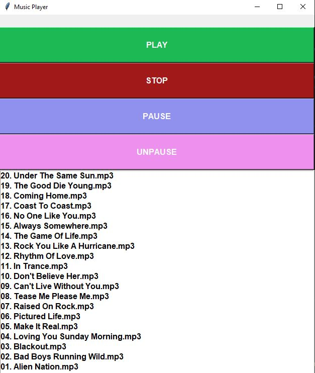

# Music-Player-py

This is a mini project in which I created a music player.

# How It Works

Once you run the application, you will be asked to select a folder that includes a list of your songs. The application will then list all the songs from that folder and you can select your desired song and play it. In addition, you can stop the song to completely stop playing the song, or pause the song.

# Tech Used

For this project I used Python, tkinter module,OS, and Pygame module. The tkinter package was used to create the widget and display the songs. I used the OS package to ask the users to select a folder and the Pygame was used to play the songs.

# How to Use

In order to use this application, simply download or clone the repo and run the application in your desired IDE. Once you run the application, you will be prompted to select a folder that includes your songs. After you select the folder, simply select the song and click Play!
